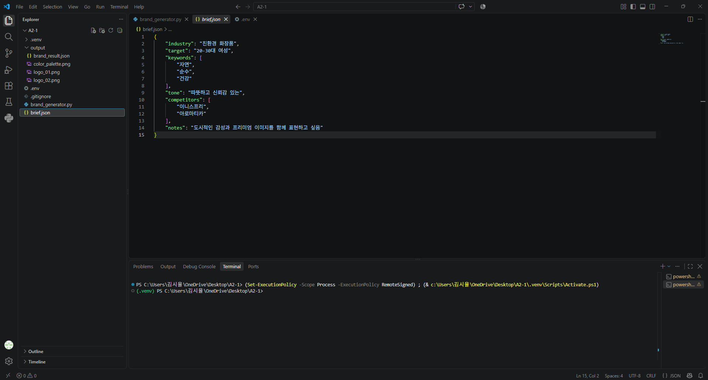
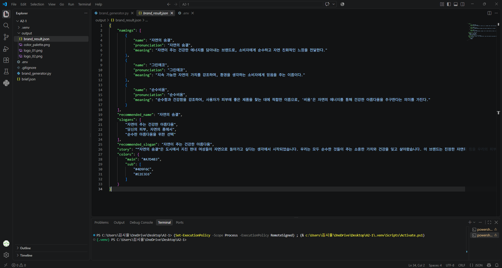
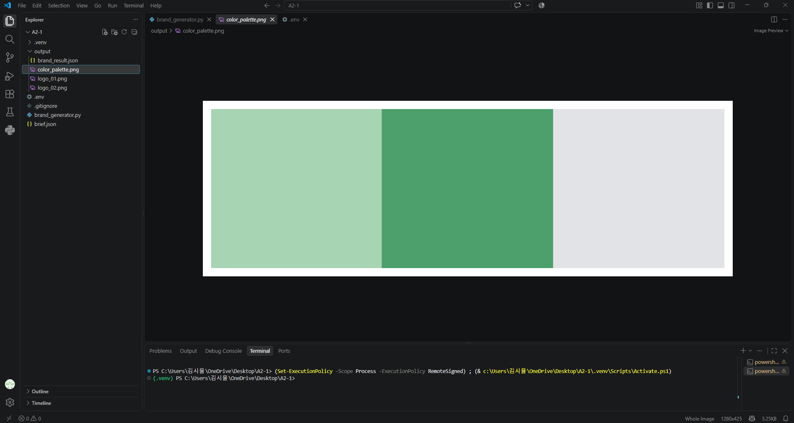
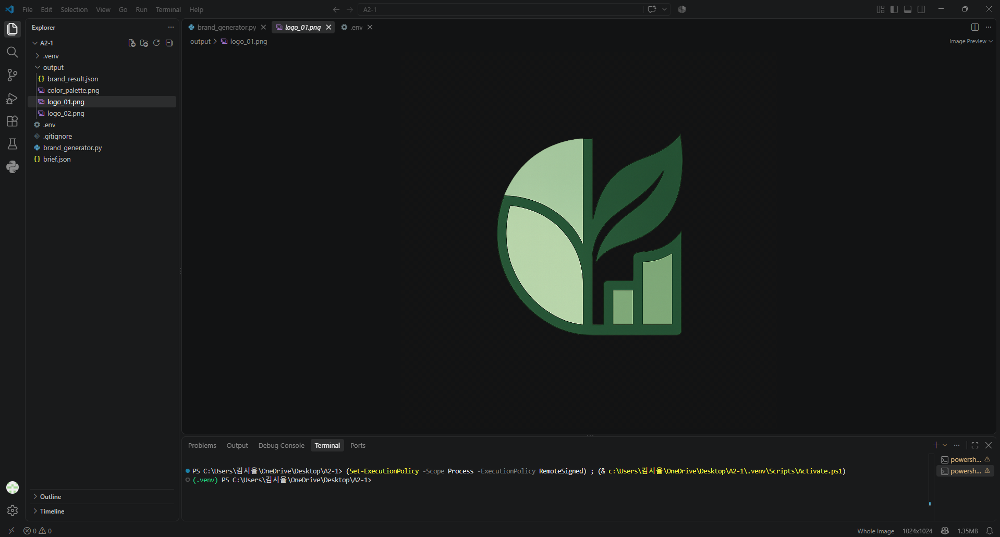
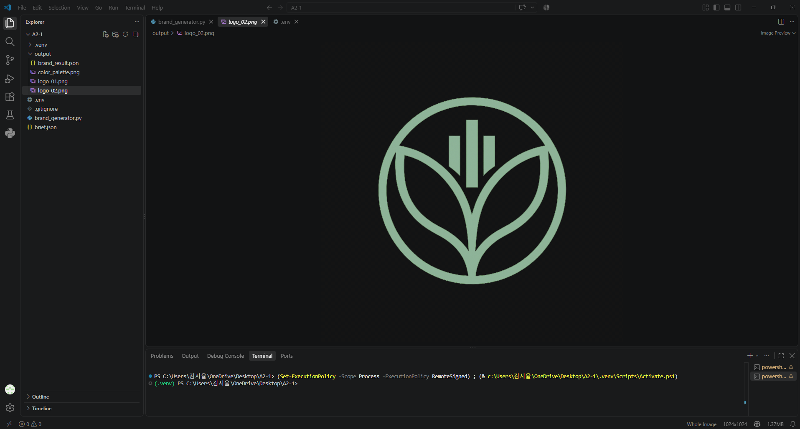

# A2-1 [Project A] AI 브랜드 아이덴티티 생성기

## 1. 개요 및 기능

- **개요**  
브랜드 브리프를 입력하면 OpenAI API를 활용해 브랜드 네이밍부터 슬로건, 스토리, 컬러 팔레트, 로고 시안까지 한 번에 생성하는 Python 프로젝트  

- **기능**  
\- 브랜드 네이밍 후보 3개와 각 이름의 한글 발음·의미 제안  
\- 후보 중 가장 적합한 AI 추천 브랜드명 선정  
\- 슬로건 후보 3개와 AI 추천 슬로건 선정  
\- 약 300자 내외 분량의 브랜드 스토리 생성  
\- 메인 컬러와 서브 컬러로 구성된 컬러 팔레트 생성  
\- AI 로고 시안 2개 생성  

## 2. 실행 준비

Python 가상환경을 만든 뒤 필요한 패키지를 설치

```bash
pip install openai python-dotenv matplotlib
```

프로젝트 폴더에 `.env` 파일을 만들고 OpenAI API 키를 설정

```env
OPENAI_API_KEY=your_api_key_here
```

`.env` 파일은 API 키를 포함하므로 Git에 업로드되지 않도록 `.gitignore`에 등록

## 3. brief.json 입력 방법

`brief.json`에 만들고 싶은 브랜드의 업종, 타겟 고객, 핵심 키워드, 톤앤매너, 경쟁사, 추가 요청사항을 작성

```json
{
  "industry": "프리미엄 반려동물 용품",
  "target": "반려동물을 가족처럼 생각하는 20~40대 소비자",
  "keywords": ["신뢰", "편안함", "교감", "프리미엄"],
  "tone": "따뜻하고 세련되며 신뢰감 있는",
  "competitors": ["바잇미", "펫프렌즈"],
  "notes": "프리미엄 라이프스타일 브랜드처럼 표현"
}
```

## 4. 실행 방법

```bash
python brand_generator.py
```

실행 후 브리프 파일 경로에 `brief.json`을 입력합니다. 출력 폴더는 Enter를 누르면 기본값인 `./output`이 사용

## 5. 결과물

`output` 폴더에 다음 파일이 생성됩니다.

- `brand_result.json`: 네이밍, 추천 네임, 슬로건, 추천 슬로건, 브랜드 스토리, 컬러 정보
- `color_palette.png`: 생성된 컬러 팔레트 이미지
- `logo_01.png`: 첫 번째 AI 로고 시안
- `logo_02.png`: 두 번째 AI 로고 시안

## 6. 테스트 결과 화면 스크린샷  

  
  
  
  
  
